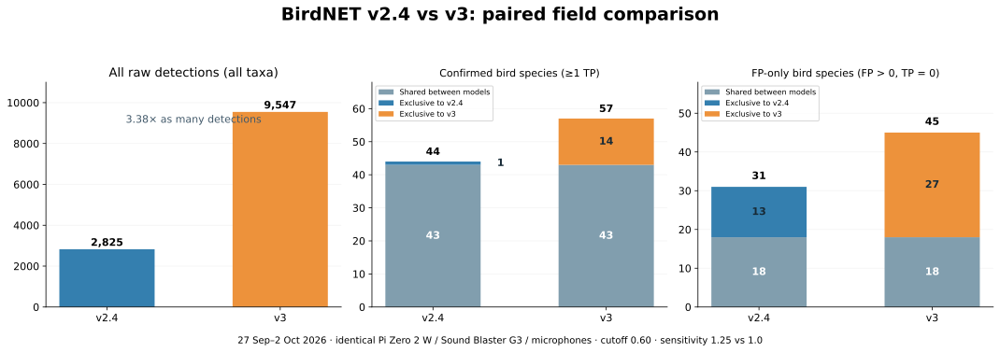

# BirdNET-Pi V3

BirdNET-Pi V3 extends [Nachtzuster/BirdNET-Pi](https://github.com/Nachtzuster/BirdNET-Pi) with BirdNET V3 Preview support, manual detection verification and a reviewed-detections export available from the web interface.

The current preview release is [v3-preview.2](https://github.com/iiukolov-max/BirdNET-Pi_v3/releases/tag/v3-preview.2). Clean-card Trixie installation stages, recording, V3 inference and reboot startup were tested on Raspberry Pi Zero 2 W. The installation was interrupted and resumed; a complete uninterrupted run of the revised installer and a full existing-device upgrade remain untested. Bookworm compatibility has not been verified with this release.

## Preview 2: installation and startup fixes

- Sudo password authentication is supported and refreshed during long installation steps.
- The explicit Zero 2 W headless profile adds **1 GiB disk-backed fallback swap**, preserving existing zram. V3 ran out of memory on the tested Trixie device even with `cma=0` and zram alone.
- Local microphone discovery prefers USB when selection is automatic, sets adjustable ALSA capture gain to 100% and unmutes capture while preserving playback volume. Hardware gain is separate from model sensitivity.
- Automatic recording and streaming share a PulseAudio input. User audio runtime/D-Bus and startup ordering allow audio to start without an SSH login. Cold-boot discovery retries and sample-based streaming timestamps address pactl timeouts and non-monotonic DTS.
- A single boot snapshot records system time, RTC presence/time and service startup information, with local log rotation. It runs approximately two minutes after boot, without periodic minute-by-minute records.

The final reboot check on a Zero 2 W with Sound Blaster Play! 3 found all 11 services active without restarts, successful WAV inference, HTTP 200, capture 100%/unmuted and one boot snapshot. No OOM, D-Bus, pactl or DTS errors were found in that checked boot. These are startup results, not a long-term endurance test. No physical RTC was installed: absence was verified; reading an attached RTC remains untested.

See [release notes](RELEASE_NOTES.md), [Trixie installation](docs/TRIXIE_INSTALLATION.md) and [boot/RTC/microphone diagnostics](docs/STARTUP_LOGGING.md).

## Changes in this fork

### BirdNET V3 and model selection

#### What V3 can recognise

BirdNET+ V3 broadens acoustic monitoring beyond birds: its classifier includes **mammals, insects and amphibians**, with smaller sets of other animal labels. It identifies sounds from the animals represented in its label list; support for a group does not mean coverage of every species in that group. The official preview describes broader animal coverage and an expanded training dataset. [Official V3 documentation](https://github.com/birdnet-team/birdnet-V3.0-dev).

The **pinned Preview 3.1 label file used by this release contains 11,560 output labels**. Counting its `class` column gives:

| Group | Labels in the pinned model | Examples from its label list |
| --- | ---: | --- |
| Birds (`Aves`) | 9,834 | Songbirds, owls, waterbirds and other birds |
| Insects (`Insecta`) | 699 | House cricket, other crickets, grasshoppers and cicadas |
| Amphibians (`Amphibia`) | 647 | Frogs and toads |
| Mammals (`Mammalia`) | 350 | Impala, moose and howler monkeys |

There are also smaller groups of reptile, crocodilian, fish and other labels. These counts describe model labels, not an independent accuracy evaluation or a count of strictly species-level taxa. Source: the [pinned official label CSV](https://zenodo.org/records/20703646/files/BirdNET%2B_V3.0-preview3.1_Global_11K_Labels.csv?download=1), whose checksum is recorded in the release manifest.

Selecting V3 enables this broader classifier without installing a separate mammal or insect detector. Results still depend on the recorded sound, microphone, thresholds and filtering. Review unfamiliar detections with TP/FP; this project has not independently validated accuracy across all these groups.

V3 also introduces 32 kHz audio input, a revised architecture and training procedure, and support for variable-duration input at the model level. This BirdNET-Pi integration continues using its configured analysis windows; it does not expose every feature of the upstream demo tools. The preview has no human-voice detection and limited handling of rain, wind and engine sounds, so it should not be treated as a validated bird/noise prefilter. [Preview features and limitations](https://github.com/birdnet-team/birdnet-V3.0-dev#about-this-release).

#### Integration and model selection

- New installations use **BirdNET+ V3.0 Developer Preview 3.1, Global 11K, FP16 pruned** by default.
- Previous BirdNET models remain available under **Tools → Settings**.
- Model switching restores the model's saved parameters and checks readiness of the current analysis process. If startup fails, the previous model and configuration are restored.
- V3 outputs are handled as probabilities without applying sigmoid again. Audio is prepared at 32 kHz.
- Tested optimisations include SoundFile/soxr audio loading, stereo-to-mono processing, selection of only the required highest-scoring predictions and short-lived TFLite output views.
- V3 inference thread count is configurable. Suitable settings depend on the device; fixed CPU frequencies used during development are not a universal default.

V3 is a **developer preview**. Sensitivity is fixed at 1.0 and the previous human-voice filter is unavailable. The current integration uses the V2 geographic model with scientific-name matching; species absent from V2 are not restricted by that filter. This is not the V3 geographic model. Some added species may lack a localised name.

### Manual TP/FP verification

Detections can be marked as:

- **TP / correct:** the identification is correct.
- **FP / false positive:** the identification is incorrect.
- **Unreviewed:** no manual assessment has been recorded.

Review marks can be changed; clicking the selected mark again removes it. Changes require authentication. Existing detections and review marks are retained by the database migration.

### Export from Tools

Open **Tools → System Controls**:

1. Select **Generate BirdDB_verified.txt**.
2. Wait for the completion message and exported record count.
3. Select **Download BirdDB_verified.txt**.

The export contains **all detections**, including TP, FP and unreviewed records. It adds `ReviewStatus` and `ReviewedAt` to the existing detection fields. Despite the filename, it is not a TP-only subset.

The existing `export_birddb_verified.py` is included **without changes**. The web integration provides authenticated launch/download, request verification, prevention of concurrent web exports and recovery of the previous output when export fails. Recording and analysis continue during export.

The exporter uses fixed paths under `/home/pi/BirdNET-Pi`, which is why installation requires user `pi`.

## Installation and model downloads

### Quick installation — no Git knowledge required

1. Use Raspberry Pi Imager to prepare **Raspberry Pi OS Lite 64-bit** on a new SD card. Create the user **`pi`**, enable SSH and configure your network. Use **Trixie** for the tested configuration; Bookworm requires a separate validation. The installer requires `/home/pi` and sudo access; it can prompt for your password. Python 3.11, 3.12 or 3.13 is required, with actual dependency installation tested on Trixie/Python 3.13.
2. Log in to the Raspberry Pi as `pi`, then copy and run this single command:

```bash
curl -fsSL https://raw.githubusercontent.com/iiukolov-max/BirdNET-Pi_v3/v3-preview.2/newinstaller.sh -o birdnet-install.sh && BIRDNET_FORK_REF=v3-preview.2 bash birdnet-install.sh
```

The command downloads the installer and runs it only if the download succeeds. The installer installs Git and other dependencies itself, retrieves this fork, downloads and verifies the V3 model, and configures the application. You do not need to clone a repository or run Git commands yourself.

**For a Raspberry Pi Zero 2 W used without a display or camera**, use this command instead. It explicitly enables the headless memory profile (`cma=0`, `gpu_mem=16`), backs up the boot files and adds 1 GiB disk-backed fallback swap:

```bash
curl -fsSL https://raw.githubusercontent.com/iiukolov-max/BirdNET-Pi_v3/v3-preview.2/newinstaller.sh -o birdnet-install.sh && BIRDNET_FORK_REF=v3-preview.2 bash birdnet-install.sh --zero2-headless
```

3. When installation completes successfully, reboot with `sudo reboot`. Open `http://<your-Pi-hostname>.local` in a browser on the same network, or use the Pi's IP address. In **Tools → Settings**, check location and recording-device settings. Confirm that recording and V3 analysis are working; on Zero 2 W also verify the headless boot profile after reboot.

These commands pin both installer and source to **Preview 2**. For the latest development version from `main` (which may change after this release), use:

```bash
curl -fsSL https://raw.githubusercontent.com/iiukolov-max/BirdNET-Pi_v3/main/newinstaller.sh -o birdnet-install.sh && bash birdnet-install.sh
```

For an existing BirdNET-Pi installation, keep its recordings and database in place. The fresh installer deliberately refuses to overwrite it; see [updates and migration](docs/UPDATES_AND_RECOVERY.md).

The V3 model binary is downloaded **separately from the official source**, together with the corresponding labels. The release manifest pins versions, download locations and checksums. The installer verifies downloads before using them and reuses already valid files.

Previous models and the required geographic model are included in the repository retrieved by the installer. After installation, inference runs locally without an internet connection. Installing or updating software and downloading missing models require network access.

## Raspberry Pi Zero 2 W

V3 testing on the development Zero 2 W used a profile **without graphics or camera**, including:

- `cma=0` in the kernel command line;
- `gpu_mem=16`;
- disabled graphics overlay and camera/display auto-detection.

The `--zero2-headless` option applies this profile specifically to Zero 2 W, backs up the boot configuration and requires a reboot. The profile also provisions `/var/lib/birdnet/swapfile` (1 GiB, priority 10), retaining existing zram (normally priority 100), and orders analysis after swap activation. It checks free space and existing file ownership/format instead of overwriting an unknown file. Disk swap consumes storage and writes to the SD card.

After reboot, check actual CMA, swap, model readiness and recording:

```bash
grep -E 'MemTotal|CmaTotal' /proc/meminfo
sudo swapon --show
sudo systemctl status birdnet_analysis birdnet_recording
sudo python3 /home/pi/BirdNET-Pi/scripts/check_model_ready.py
```

`CmaTotal` must be zero; editing boot files alone does not apply the setting. An active analysis process alone does not prove inference readiness. Other Raspberry Pi models do not receive these boot settings automatically.

These settings are intended for deployments without graphics or camera. V3 remains demanding on a device with 512 MB RAM; the profile alone does not guarantee sustained real-time operation. The measurements below describe the tested Zero 2 W setup, not performance guarantees for other boards.

CPU frequency limits and disabling Wi-Fi/Bluetooth are not applied automatically by this release.

## Boot time, RTC and microphone logs

The startup timer writes one snapshot per boot to `/var/log/birdnet/startup.jsonl` and the system journal, approximately two minutes after boot. It includes UTC/local system time, timezone/NTP, boot ID, uptime, estimated boot time, service start times/states and restart counts. Logs rotate with fourteen retained archives.

```bash
sudo tail -n 1 /var/log/birdnet/startup.jsonl | python3 -m json.tool
sudo journalctl -u birdnet-startup-log.service -b
sudo journalctl -u birdnet_recording.service -b
```

RTC detection, its reported time and read errors are separate fields. Without a kernel-detected RTC the log reports absence and no RTC time; recording continues. Reading the clock does not change it. An attached board needs the correct driver/device-tree configuration; detection does not verify battery health. The fixed two-minute snapshot is not a measurement of model readiness. See [full diagnostics documentation](docs/STARTUP_LOGGING.md).

An explicit recording device remains an operator choice; custom PCM names are preserved. Devices without adjustable gain continue recording with a logged explanation. Missing microphones cause recording startup retries, and RTSP input skips local hardware setup.

## V2.4 versus V3: measured power consumption

Measurements were taken on 4–5 October 2026 using a Raspberry Pi Zero 2 W and an external USB power meter. They describe the **whole assembly**, including the Sound Blaster Play! 3 USB sound card, microphone, USB hub and USB Ethernet adapter. Wi-Fi, Bluetooth and HDMI were disabled; the tested system used the headless/CMA-disabled profile. USB Ethernet remained connected for every comparison.

Timer values below are minutes:seconds. Current and energy readings were supplied by the operator. Average power is `mWh / 1000 × 3600 / elapsed_seconds`; average current is `mAh × 3600 / elapsed_seconds`.

| Mode | Duration | mAh | mWh | Average current | Average power |
|---|---:|---:|---:|---:|---:|
| V3, 1 inference thread, CPU 600–1000 MHz | 21:51 | 146 | 770 | 400.9 mA | 2.114 W |
| V3, 2 inference threads, CPU 600–1000 MHz | 22:30 | 153 | 811 | 408.0 mA | 2.163 W |
| V3, 4 inference threads, CPU 600 MHz | 19:16 | 129 | 678 | 401.7 mA | 2.111 W |
| WAV recording only, CPU 600 MHz | 19:21 | 71 | 372 | 220.2 mA | **1.153 W** |
| V2.4, standard interpreter, CPU 600 MHz | 16:51 | 69 | 365 | 245.7 mA | **1.300 W** |
| Optimised V3, 2 threads, CPU 600 MHz, accumulated backlog | 14:51 | 108 | 571 | 436.4 mA | **2.307 W** |
| Optimised V3, 4 threads, requested CPU 1000 MHz, accumulated backlog | 17:16 | 200 | 1065 | 695.0 mA | **3.701 W** |

In these measurements V2.4 consumed about **38.4% less power** than V3/4 threads/600 MHz, and added about **0.146 W** over recording alone. Optimised V3/2/600 consumed about 77.5% more than V2.4, but these tests had different workloads: processing a large backlog keeps inference busy, whereas a caught-up system can wait between files. The table therefore does **not** establish that an optimisation increased power consumption or that one thread count is universally more efficient. A repeated comparison on identical audio and workload is required.

At the end of the 4-thread/1000 MHz test, temperature reached **82.7 °C** and firmware reported frequency capping, with throttling recorded since boot. The sysfs frequency setting alone does not demonstrate an unrestricted physical clock. Initial 30-second files took about 10.9–11.5 seconds to analyse; later files averaged about **12.5 seconds**. Thermal behaviour is part of this measured result, not an excluded condition.

One subsequent test at **1 thread/800 MHz** processed its first 30-second file in 29.93 seconds; no USB power result was collected for that setting. A single file does not establish sustained throughput, and the margin for clearing a backlog was small.

These are short development measurements, not guaranteed battery life or a power specification for other Raspberry Pi models. CPU frequency limits were test settings. Quantities stated for FP16 models do not imply hardware FP16 computation on the Zero 2 W.

### Battery-life estimates

For an illustrative 80 Ah power bank rated at a 3.7 V cell voltage, nominal energy is 296 Wh. Assuming 80–90% usable energy, recording alone would give roughly **8.55–9.62 days**, and V2.4 roughly **7.59–8.54 days**. The actual usable energy has not been measured, and neither estimate is a completed field endurance test. A 10-day target would require about 0.987–1.110 W under those assumptions, below the measured recording-only baseline.

## Recognition comparison and validation limits

### Paired field comparison: V2.4 versus V3

Two identical Raspberry Pi Zero 2 W devices with Sound Blaster G3 sound cards and identical microphones recorded at the same location from **27 September to 2 October 2026**. In the aligned export period, V3 produced **3.38 times as many raw detections** and **57 TP-confirmed bird species**, versus **44** for V2.4.

| Metric | V2.4 | V3 | Shared between models | V2.4 only | V3 only |
|---|---:|---:|---:|---:|---:|
| Raw detections, all taxa | 2,825 | 9,547 | — | — | — |
| Bird species with at least one reviewed TP | 44 | 57 | 43 | 1 | 14 |
| FP-only bird species: reviewed FP, no reviewed TP | 31 | 45 | 18 | 13 | 27 |



TP/FP species counts use reviewed detections only; unreviewed records are excluded. FP-only status is assigned separately for each model, so a species may be FP-only in one and TP-confirmed in the other. Raw detections include unreviewed records and V3 non-bird labels. Both used confidence ≥0.60 and overlap 0; sensitivity was 1.25 for V2.4 and 1.0 for V3. These are results from one field deployment with incomplete review, not a controlled same-audio accuracy benchmark. More detections do not by themselves establish better accuracy.

See the [detailed field comparison and discussion draft](docs/model-comparison/field-comparison.md) for species lists, interval results, confidence thresholds and review limitations.

A development comparison used 11 saved recordings, 249 seconds of audio and 88 three-second windows. V2.4 and V3 had different top-1 predictions in 51 windows and completely disjoint top-3 predictions in 39. Among 43 windows where at least one model had top-1 confidence of 0.6 or higher, top-1 differed in 9 windows and top-3 was disjoint in 2. No window had different top-1 predictions with confidence of at least 0.6 in both models.

These figures measure **prediction disagreement**, not which model is more accurate. Archive folder names were generated by an earlier model, not independent ground truth. Confidence values are not calibrated between versions; a larger value does not prove a better identification.

The revised audio preparation was checked for equivalence with the previous pipeline. V3 top-k/output-view optimisation and stereo preparation were also tested against the previous code. An isolated hour-long archive analysis completed 160 files without the earlier OOM failure; later paced pipeline checks included extracted FLAC/PNG files and temporary database output. These checks cover specific stages and conditions, not every live deployment, notification backend or hardware configuration.

## Optional operational telemetry

The included `scripts/power_metrics.py` helper provides a bounded rotating log of CPU utilisation, temperature, frequency/capping flags, RAM/swap activity, analysis/recording processes and queue size/age. It is **not a wattmeter**; USB power/energy comparisons require external measurement.

## Validation and limitations

Export generation/download was tested through the development device's web interface. Isolated tests cover TP/FP changes and removal, preservation of 79,341 detections and 4,050 reviews during database migration, model-download integrity, boot configuration transformations and update failure handling. Privileged service/dependency/model actions were simulated in the updater tests.

Clean-card installation stages and reboot startup were tested on Trixie, with an interrupted dependency stage resumed separately. A complete uninterrupted run of the revised installer, Bookworm installation, attached RTC read, long-term stability and a complete device upgrade remain untested. Recognition comparisons are not independent accuracy benchmarks, and development measurements do not establish performance on every board. This release does not include a bird/noise prefilter.

The original project description and documentation from Nachtzuster are retained below as an attributed upstream reference. Its installation/migration commands target the original project; use the fork-specific quick-install commands above for this V3 fork.

---

<details>
<summary>Original Nachtzuster README — project description and upstream documentation</summary>

Source: [Nachtzuster/BirdNET-Pi README](https://github.com/Nachtzuster/BirdNET-Pi/blob/main/README.md), retrieved 5 October 2026. The following section is preserved from upstream. Use the fork-specific sections above for changes in this project.

<h1 align="center"><a href="https://github.com/mcguirepr89/BirdNET-Pi/blob/main/LICENSE">Review the license!!</a></h1>
<h1 align="center">You may not use BirdNET-Pi to develop a commercial product!!!!</h1>
<h1 align="center">
  BirdNET-Pi
</h1>
<p align="center">
A realtime acoustic bird classification system for the Raspberry Pi 5, 4B, 400, 3B+, and 0W2
</p>
<p align="center">
  
</p>
<p align="center">
Icon made by <a href="https://www.freepik.com" title="Freepik">Freepik</a> from <a href="https://www.flaticon.com/" title="Flaticon">www.flaticon.com</a>
</p>

## About this fork:
I've been building on [mcguirepr89's](https://github.com/mcguirepr89/BirdNET-Pi) most excellent work to further update and improve BirdNET-Pi. Maybe someone will find it useful.

Changes include:

 - Backup & Restore
 - Web ui is much more responsive
 - Daily charts now include all species, not just top/bottom 10
 - Bump apprise version, so more notification type are possible
 - Swipe events on Daily Charts (by @croisez)
 - Support for 'Species range model V2.4 - V2'
 - Bookworm and Trixie support
 - Experimental support for writing transient files to tmpfs
 - Rework analysis to consolidate analysis/server/extraction. Should make analysis more robust and slightly more efficient, especially on installations with a large number of recordings
 - Bump tflite_runtime to 2.17.1, it is faster
 - Rework daily_plot.py (chart_viewer) to run as a daemon to avoid the very expensive startup
 - Lots of fixes & cleanups

!! note: see 'Migrating' on how to migrate from mcguirepr89

## Introduction
BirdNET-Pi is built on the [BirdNET framework](https://github.com/kahst/BirdNET-Analyzer) by [**@kahst**](https://github.com/kahst) <a href="https://creativecommons.org/licenses/by-nc-sa/4.0/"></a> using [pre-built TFLite binaries](https://github.com/PINTO0309/TensorflowLite-bin) by [**@PINTO0309**](https://github.com/PINTO0309) . It is able to recognize bird sounds from a USB microphone or sound card in realtime and share its data with the rest of the world.

Check out birds from around the world
- [BirdWeather](https://app.birdweather.com)<br>

## Features
* **24/7 recording and automatic identification** of bird songs, chirps, and peeps using BirdNET machine learning
* **Automatic extraction and cataloguing** of bird clips from full-length recordings
* **Tools to visualize your recorded bird data** and analyze trends
* **Live audio stream and spectrogram**
* **Automatic disk space management** that periodically purges old audio files
* [BirdWeather](https://app.birdweather.com) integration -- you can request a BirdWeather ID from BirdNET-Pi's "Tools" > "Settings" page
* Web interface access to all data and logs provided by [Caddy](https://caddyserver.com)
* [GoTTY](https://github.com/yudai/gotty) and [GoTTY x86](https://github.com/sorenisanerd/gotty) Web Terminal
* [Tiny File Manager](https://tinyfilemanager.github.io/)
* FTP server included
* SQLite3 Database
* [Adminer](https://www.adminer.org/) database maintenance
* [phpSysInfo](https://github.com/phpsysinfo/phpsysinfo)
* [Apprise Notifications](https://github.com/caronc/apprise) supporting 90+ notification platforms
* Localization supported

## Requirements
* A Raspberry Pi 5, Raspberry 4B, Raspberry Pi 400, Raspberry Pi 3B+, or Raspberry Pi 0W2 (The 3B+ and 0W2 must run on RaspiOS-ARM64-**Lite**)
* An SD Card with the **_64-bit version of RaspiOS_** installed (please use Trixie) -- Lite is recommended, but the installation works on RaspiOS-ARM64-Full as well. Downloads available within the [Raspberry Pi Imager](https://www.raspberrypi.com/software/).
* A USB Microphone or Sound Card

## Installation
[A comprehensive installation guide is available here](https://github.com/mcguirepr89/BirdNET-Pi/wiki/Installation-Guide). This guide is slightly out-dated: make sure to pick Bookworm, also the curl command is still pointing to mcguirepr89's repo.

Please note that installing BirdNET-Pi on top of other servers is not supported. If this is something that you require, please open a discussion for your idea and inquire about how to contribute to development.

[Raspberry Pi 3B[+] and 0W2 installation guide available here](https://github.com/mcguirepr89/BirdNET-Pi/wiki/RPi0W2-Installation-Guide)

The system can be installed with:
```
curl -s https://raw.githubusercontent.com/Nachtzuster/BirdNET-Pi/main/newinstaller.sh | bash
```
The installer takes care of any and all necessary updates, so you can run that as the very first command upon the first boot, if you'd like.

The installation creates a log in `$HOME/installation-$(date "+%F").txt`.
## Access
The BirdNET-Pi can be accessed from any web browser on the same network:
- http://birdnetpi.local OR your Pi's IP address
- Default Basic Authentication Username: birdnet
- Password is empty by default. Set this in "Tools" > "Settings" > "Advanced Settings"

Please take a look at the [wiki](https://github.com/mcguirepr89/BirdNET-Pi/wiki) and [discussions](https://github.com/mcguirepr89/BirdNET-Pi/discussions) for information on
- [BirdNET-Pi's Deep Convolutional Neural Network(s)](https://github.com/mcguirepr89/BirdNET-Pi/wiki/BirdNET-Pi:-some-theory-on-classification-&-some-practical-hints)
- [making your installation public](https://github.com/mcguirepr89/BirdNET-Pi/wiki/Sharing-Your-BirdNET-Pi)
- [backing up and restoring your database](https://github.com/mcguirepr89/BirdNET-Pi/wiki/Backup-and-Restore-the-Database)
- [adjusting your sound card settings](https://github.com/mcguirepr89/BirdNET-Pi/wiki/Adjusting-your-sound-card)
- [suggested USB microphones](https://github.com/mcguirepr89/BirdNET-Pi/discussions/39)
- [building your own microphone](https://github.com/DD4WH/SASS/wiki/Stereo--(Mono)-recording-low-noise-low-cost-system)
- [privacy concerns and options](https://github.com/mcguirepr89/BirdNET-Pi/discussions/166)
- [beta testing](https://github.com/mcguirepr89/BirdNET-Pi/discussions/11)
- [and more!](https://github.com/mcguirepr89/BirdNET-Pi/discussions)


## Updating 

Use the web interface and go to "Tools" > "System Controls" > "Update". If you encounter any issues with that, or suspect that the update did not work for some reason, please save its output and post it in an issue where we can help.

## Backup and Restore
Use the web interface and go to "Tools" > "System Controls" > "Backup" or "Restore". Backup/Restore is primary meant for migrating your data for one system to another. Since the time required to create or restore a backup depends on the size of the data set and the speed of the storage, this could take quite a while.

Alternatively, the backup script can be used directly. These examples assume the backup medium is mounted on `/mnt`

To backup:
```commandline
./scripts/backup_data.sh -a backup -f /mnt/birds/backup-2024-07-09.tar
```
To restore:
```commandline
./scripts/backup_data.sh -a restore -f /mnt/birds/backup-2024-07-09.tar
```

## x86_64 support
x86_64 support is mainly there for developers or otherwise more Linux savvy people.
That being said, some pointers:
- Use Debian 12 or 13
- The user needs passwordless sudo

For Proxmox, a user has reported adding this in their `cpu-models.conf`, in order for the custom TFLite build to work.
```
cpu-model: BirdNet
    flags +sse4.1
    reported-model host
```

## Uninstallation
```
/usr/local/bin/uninstall.sh && cd ~ && rm -drf BirdNET-Pi
```
## Migrating
Before switching, make sure your installation is fully up-to-date. Also make sure to have a backup, that is also the only way to get back to the original BirdNET-Pi.
Please note that upgrading your underlying OS to Bookworm is not going to work. Please stick to Bullseye. If you do want Bookworm, you need to start from a fresh install and copy back your data. (remember the backup!)

Run these commands to migrate to this repo:
```
git remote remove origin
git remote add origin https://github.com/Nachtzuster/BirdNET-Pi.git
./scripts/update_birdnet.sh
```
## Troubleshooting and Ideas
*Hint: A lot of weird problems can be solved by simply restarting the core services. Do this from the web interface "Tools" > "Services" > "Restart Core Services"
Having trouble or have an idea? *Submit an issue for trouble* and a *discussion for ideas*. Please do *not* submit an issue as a discussion -- the issue tracker solicits information that is needed for anyone to help -- discussions are *not for issues*.

PLEASE search the repo for your issue before creating a new one. This repo has nothing to do with the validity of the detection results, so please do not start any issues around "False positives."

## Sharing
Please join a Discussion!! and please join [BirdWeather!!](https://app.birdweather.com)
I hope that if you find BirdNET-Pi has been worth your time, you will share your setup, results, customizations, etc. [HERE](https://github.com/mcguirepr89/BirdNET-Pi/discussions/69) and will consider [making your installation public](https://github.com/mcguirepr89/BirdNET-Pi/wiki/Sharing-Your-BirdNET-Pi).

## Homeassistant addon

BirdNET-Pi can also be run as a [Homeassistant](https://www.home-assistant.io/) addon through docker.
For more information : https://github.com/alexbelgium/hassio-addons/blob/master/birdnet-pi/README.md

## Docker

BirdNET-Pi can also be run as as a docker container.
For more information : https://github.com/alexbelgium/hassio-addons/blob/master/birdnet-pi/README_standalone.md

## Cool Links

- [Marie Lelouche's <i>Out of Spaces</i>](https://www.lestanneries.fr/exposition/marie-lelouche-out-of-spaces/) using BirdNET-Pi in post-sculpture VR! [Press Kit](https://github.com/mcguirepr89/BirdNET-Pi-assets/blob/main/dp_out_of_spaces_marie_lelouche_digital_05_01_22.pdf)
- [Research on noded BirdNET-Pi networks for farming](https://github.com/mcguirepr89/BirdNET-Pi-assets/blob/main/G23_Report_ModelBasedSysEngineering_FarmMarkBirdDetector_V1__Copy_.pdf)
- [PixCams Build Guide](https://pixcams.com/building-a-birdnet-pi-real-time-acoustic-bird-id-station/)
- [Core-Electronics](https://core-electronics.com.au/projects/bird-calls-raspberry-pi) Build Article
- [RaspberryPi.com Blog Post](https://www.raspberrypi.com/news/classify-birds-acoustically-with-birdnet-pi/)
- [MagPi Issue 119 Showcase Article](https://magpi.raspberrypi.com/issues/119/pdf)


### Internationalization:
The bird names are in English by default, but other localized versions are available thanks to the wonderful efforts of [@patlevin](https://github.com/patlevin) and Wikipedia. Use the web interface's "Tools" > "Settings" and select your "Database Language" to have the detections in your language.

[Internationalization](docs/translations.md)


## Screenshots


## :thinking:
Are you a lucky ducky with a spare Raspberry Pi? [Try Folding@home!](https://foldingathome.org/)

</details>

